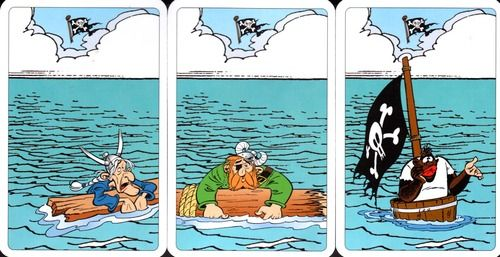

# Predicting the Success of Pirate Attacks

This repo took shape during my Data Science course at Propulsion Academy in Zurich and was inspired by various in-class exercises. It gives a good overview of the content covered during the first month.

 Image copyright: Asterix & Obelix 

## <!-- TABLE OF CONTENTS -->

  
Table of Contents

  <ol>
    <li>
      <a href="#assignment-description">Assignment Description</a>
    </li>
    <li>
      <a href="#data-cleaning">Data cleaning</a>
      <ul>
        <li><a href="#prerequisites">Prerequisites</a></li>
        <li><a href="#installation">Installation</a></li>
      </ul>
    </li>
    <li><a href="#visualizations">Visualizations of different features</a></li>
    <li><a href="#preprocessing">Preprocessing</a></li>
    <li><a href="#evaluating-different-models">Evaluating different models</a></li>
    <li><a href="#finding-the-best-model">Finding the best model</a></li>
    <li><a href="#explaining-the-results">Explaining the results</a></li>
  </ol>

